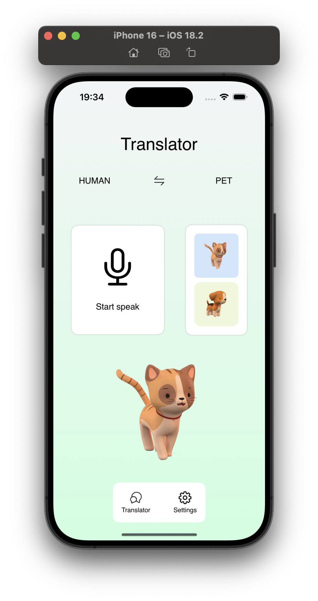
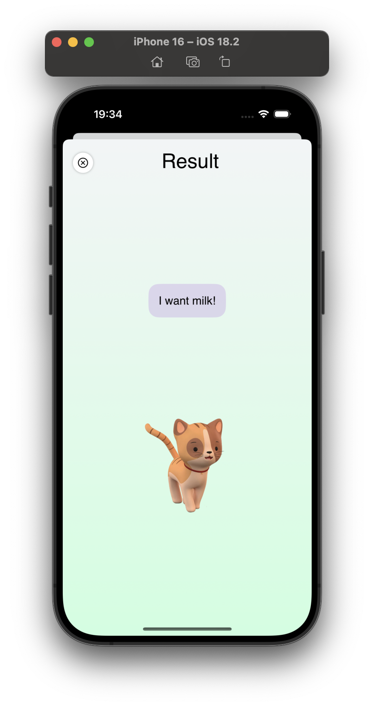
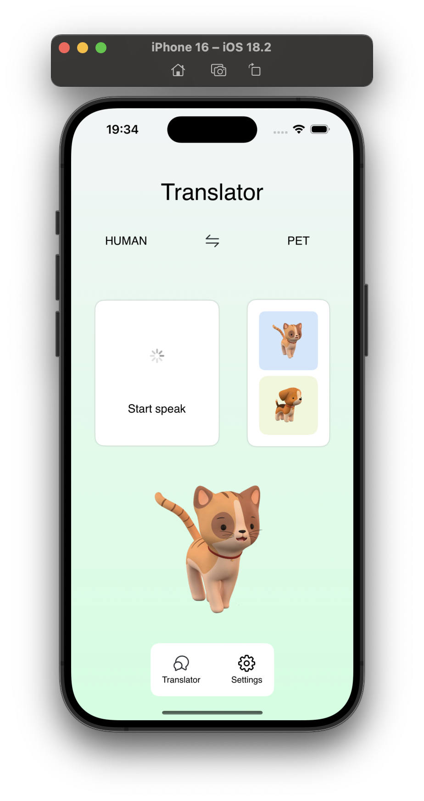

🎙️ VoiceConverter
VoiceConverter — это SwiftUI-приложение, которое преобразует голосовые команды в реакции питомца. В приложении можно взаимодействовать с виртуальным питомцем, который отвечает на реплики человека, а также переключаться между персонажами.

📱 Основные возможности
🗣️ Голосовое взаимодействие — питомец реагирует на голосовые команды.
🔄 Переключение персонажей — возможность смены роли (человек ↔ питомец).
🐶🐱 Выбор питомца — поддержка собаки и кошки с разными репликами.
🎨 Современный UI — плавные анимации, минималистичный дизайн.
⚙️ Настройки — доступ через всплывающее popover-меню.

🛠️ Технологии
SwiftUI — построение UI.
Combine — реактивное обновление данных.
MVVM — структурирование кода.
Realm (по желанию) — хранение истории взаимодействий.

💡 Дальнейшие улучшения
🎙️ Интеграция Speech-to-Text для распознавания речи.
🎵 Озвучка питомца при ответах.
🌎 Поддержка мульти-языков.

👨‍💻 Автор
Vitalii Navrotskij
📧 Email: vitalik.nav@gmail.com

